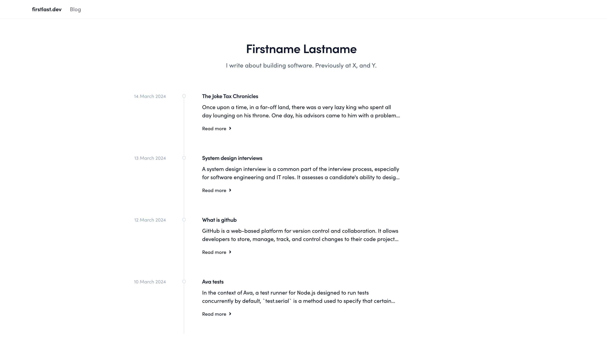

# minimal-blog-starter
A minimal remake of the [next.js blog starter](https://github.com/vercel/next.js/tree/canary/examples/blog-starter) using tailwind css and shadcn/ui. Inspired by the [tailwind blog](https://tailwindcss.com/blog) and [shadcn website](https://ui.shadcn.com/).

Visit: [https://minimal-blog-starter.vercel.app/](https://minimal-blog-starter.vercel.app/)

